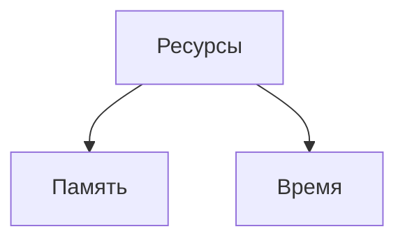

# Лекция №1
## Оценка сложности алгоритмов

### Зачем нужна оценка сложности алгоритмов?
1. Видеть и исправлять неоптимальный код
2. Ни один серьзеный проект (code review) и собеседование не могут без нее обойтись
3. Непонимание ведет к потере производительности

Память или время?
Многие алгоритмы предлагают выбор между объёмом памяти и скоростью. Задачу можно решить быстро, использую большой объём памяти, или медленнее, занимая меньший объём.

#### Пример

Типичным примером в данном случае служит алгоритм поиска кратчайшего пути.
Представив карту города в виде сети, можно написать алгоритм для определения кратчайшего расстояния между двумя любыми точками этой сети. Чтобы не вычислять эти расстояния всякий раз, когда они нам нужны, мы можем вывести кратчайшие расстояния между всеми точками и сохранить результаты в таблице. Когда нам понадобится узнать кратчайшее расстояние между двумя заданными точками, мы можем просто взять готовое расстояние из таблицы.
Результат будет получен мгновенно, но это потребует огромного объёма памяти.

В лекции был приведен пример алгоритм быстрого возведения в степень, где составляется матрица результатов. 

Из этой зависимости проистекает идея объёмно-временной сложности. При таком подходе алгоритм оценивается, как с точки зрении скорости выполнения, так и с точки зрения потреблённой памяти.

При сравнении различных алгоритмов важно знать, как их сложность зависит от объёма входных данных.

### Big O

Мы не можем использовать время для оценки сложности алгоритмов, так как на разных устройствах они выполняются за разное время. Например крутой комп с геймерской LGBT подсветкой выполнит код намного быстрее, чем бабушкин ноутбук.

Что делать? Ответ прост - любой алгоритм содержит некоторое количество шагов.

> Идея Big O - показать количество шагов алгоритма

Big O показывает верхнюю границу зависимости между входными параметрами функции и количеством операций, которые выполнит процессор.

Big описывает только скорость роста, поэтому константы отбрасываем

#### Сложность O(n)
Алгоритм имеет сложность $O(f(n))$, если при увеличении данных $n$, время выполнения алгоритма возрастает с той же скоростью, что и функция $f(n)$.

#### Нужно учитывать только ту часть, которая возрастает быстрее всего
Оценивая порядок сложности алгоритма, необходимо использовать только ту часть, которая возрастает быстрее всего (если она значительно больше, в 2 раза и более). Предположим, что рабочий цикл описывается выражением $n^3+n$. В таком случае его сложность будет равна $O(n^3)$.

Рассмотрение быстро растущей части функции позволяет оценить поведение алгоритма при увеличении n. Например, при n=100, то разница между $n^3+n=1000100$ и $n=1000000$ равна всего лишь $100$, что составляет 0,01%.

При вычислении O можно не учитывать постоянные множители в выражениях. Алгоритм с рабочим шагом $3n^3$ рассматривается, как $O(n^3)$. Это делает зависимость отношения $O(n)$ от изменения размера задачи более очевидной.

#### примеры отбрасывания сложности

$O(N^2+N)=O(N^2)$

$O(N + log N) = O(N)$

$O(5 * 2^N + 10 * N^100) = O(2^N)$

## Ссылки
[Статья на хабре](https://habr.com/ru/post/104219/)

[Видео на ютубе](https://www.youtube.com/watch?v=ZRdOb4yR0kk&ab_channel=CronisAcademy)

Задизайнил Валера Два Сарая